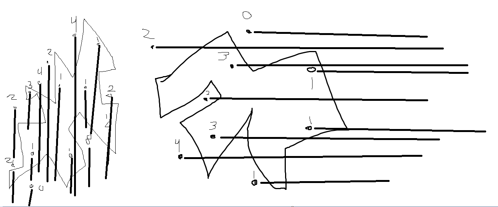

# Point Inside Shape Write Up

## Computational Problem Statement
### Name: IsPointInsideShape

Description: Given a sequence of $n$ vertices representing a shape, determine if a given point $p$ is within the boundaries of the shape defined by the sequence.

Input: A point, $p_i = <x_i, y_i>$, representing a 2D point and a sequence $S = <p_0, p_1, ..., p_{n-1}>$ where $n$ is the number of vertices represented by each point in the sequence $S$ and for all points, $p_k \in S$ for some $0 < k < n$, $p_k = <x_k, y_k>$ where $x_k$ and $y_k$ are the x and y values for a given point.

Output: A boolean, if the given point $p$ is inside the shape defined by the seqence $S$.

## Decision Rule Description
To determine if a point, $p$, is inside our shape defined by the sequence $S$, we will observe how often a line casted from the point $p$ to the boundaries of the shape will intersect the shape boundaries. If this line intersects the shape's boundaries an odd number of times, the point is within the shape. Otherwise, if the line interesects the shape's boundaries and even number of times, the point is outside of the shape.

### Examples
Insert example of convex shape before submission...
TODO

Observe here for both convex and concave shapes that for a given point inside the shape, a line casted t othe farthest right boundary shall intersect the shape's boundaries an odd amount of times to determine if it is inside of the shape.

Similarly, points outside of the shape intersect the shape an odd amount of times when a line is casted from the point to the farthest right boundary of the shape.

Here, we can observe that when the line casted from the point intersects a boundary, the line enters a new boundary and that when it intersect the boundary again, it has re-entered the shape. Therefore, if the number of intersections if odd, it implies that the line was casted from within the shape. This also implies that if the number of intersections was even, then the line was casted from outside of the shape.

## Algorithm Correctness
<!-- Something about Jordan Curve Theorem -->
Loop Invariant: $\forall 0 \leq j < i$, inside is true if the number of intersections for all line segments $p_j \in S$ from the given point $p$ is even or 0.

Using this loop invariant, we can identify that whenever an intersection between the casted line and a line segment formed between points of a shape is found, the algorithm accounts for this being becoming true or false bsaed off its previous state. In total, the algorithm preserves the number of intersections through a boolean consistently. As such, we can identify through this algorithm in the end result if a line casted from the point to a point beyond the shape will intersect the boundaries of the shape an even or odd number of times which will identify if the point is outside of the shape or inside of the shape respectively.